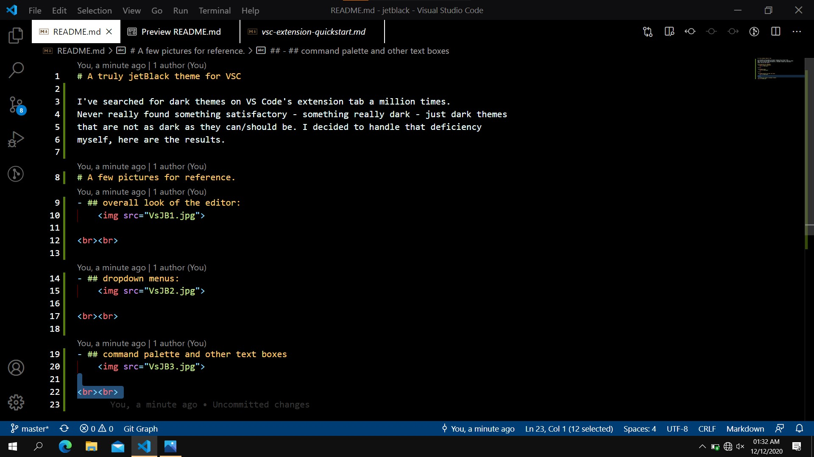
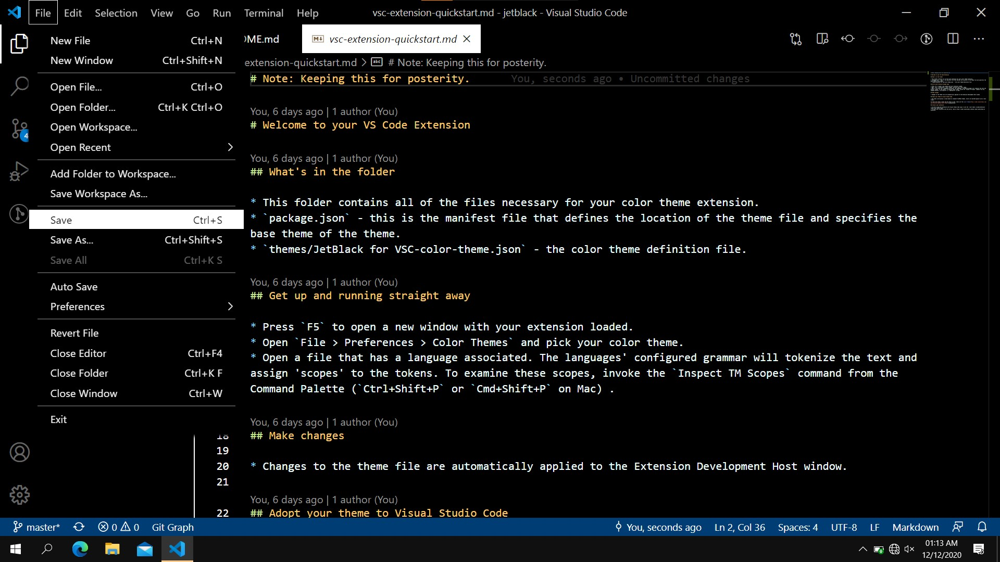
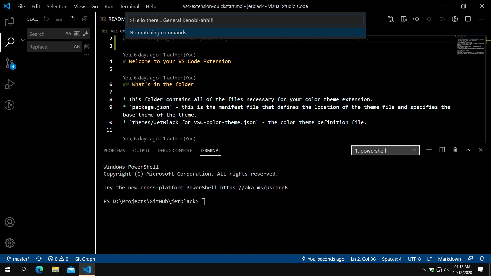
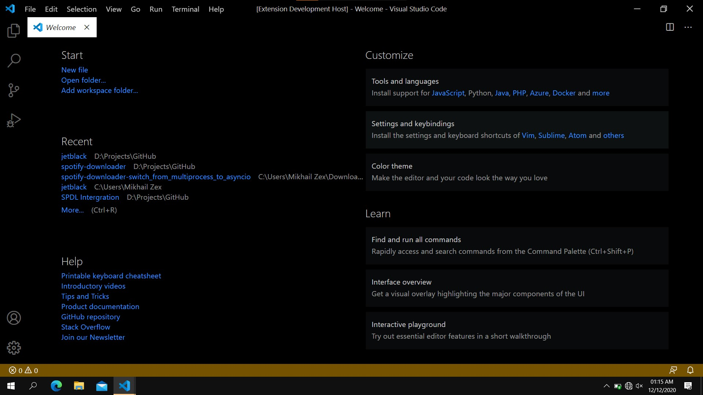

# A truly jetBlack theme for VSC

I've searched for dark themes on VS Code's extension tab a million times.
Never really found something satisfactory - something really dark - just dark themes
that are not as dark as they can/should be. I decided to handle that deficiency
myself, here are the results.

  

# A few pictures for reference.
- ## overall look of the editor:
    

  

- ## dropdown menus:
    

  

- ## command palette and other text boxes
    

  

- ## bottom bar outside a workspace (folder)

